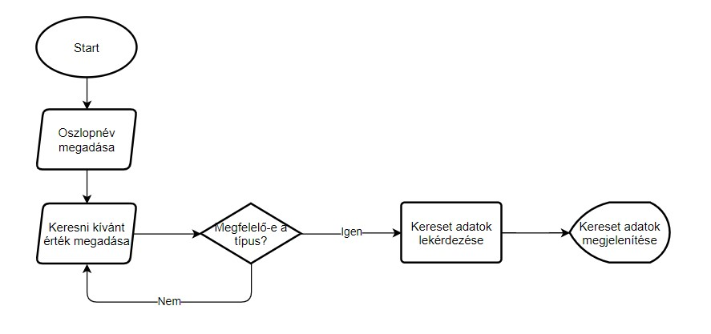
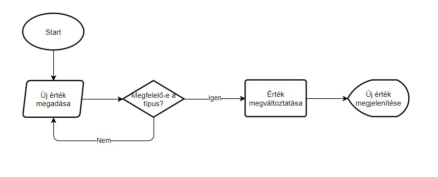
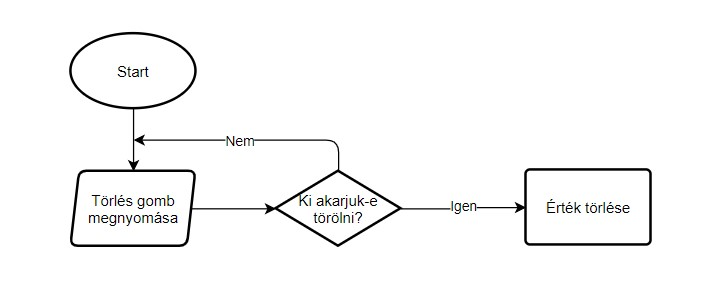
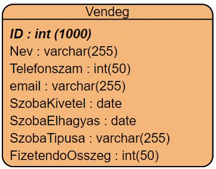

# Rendszerterv

## 1. Bevezetés
A rendszerterv elkészítésének célja az, hogy a program fejlesztői pontos, részletes és szaknyelvet tartalmazó leírással rendelkezzenek ami a rendszerrel kapcsolatos összes fontos szakmai kérdést magában foglalja. A szoftver egy Balaton parti panzió működését hivatott elősegíteni. Célja az analóg rendszer digitálisra cserélése ennek következtében a panzió befogadóképességét képes növelni és a dolgozók munkáját meggyorsítani. Adminisztratív és egyéb feladatokat lát el számítógépes környezetben. A cél platformunk a panzió tulajdonában lévő számítógépek melyek Windows operációs rendszert futtatnak. A megvalósítás miatt a program alkalmas lehet más operációs rendszer alatti futtatásra is, de ez nem elsődleges cél. A gépek hardverje 8 GB DDR4 -es RAMból, egy Intel Core i7-9750H 2.60GHz típusú processzorból és egy NVIDIA GeForce GTX 1660ti típusú videokártyából állnak. A gépek számára biztosítva van a stabil 20Mb/s sávszélességű internetelérés. Ezáltal a megfelelő infrastruktúra kiépítésével megvan teremtve a megfelelő háttér, hogy a dolgozók lehető legjobb hatásfokkal képesek legyenek használni a szoftvert. A rendszer felépítése egy Mysql alapokra épülő modell,egy közös sql adatbázis motorral rendelkező adatbázison, amelytárolja az elérhető szobákat, illetve a vendégek alapvetően szükséges adatait amely könnyű és egyszerű működésű lesz, hogy a panzió dolgozói kevés idő ráfordítása után is képesek legyek átlátni a szoftvert és kényelmesen tudják használni azt. Ezért a tervezet szerint olyan programozási nyelvet használunk ami megkönnyíti ennek a szoftvernek a leghatékonyabb lekódolását. Erről bővebben a Fejlesztő eszközök fejezetben lesz majd szó. A digitalizálás hatására sokkal gyorsabb, egyszerűbb és biztonságosabb lesz az új rendszer a régihez képest.

## 2. A rendszer célja
A rendszer célja, hogy a panzió elavult adminisztrációs módszereit felváltsa ez a 21. századi, adatbázissal rendelkező alkalmazás amivel a panzió adminisztrációs munkája gyorsabb, egyszerűbb és biztonságosabb lesz. A programot használó dolgozóknak nagyon sok ideje fel fog szabadulni a program gyorsasága miatt, így foglalkozhat más teendőkkel is akár, vagy több vendéget is tud kevesebb idő alatt adminisztrálni.

## 3. A projekt tervezete

* 3.1. A rendszer felépítése
Az adatbázis kapcsolathoz szükséges egy adatbázis connection osztály,
amely létrehozza, fenntartja, és zárja az adatbáziskapcsolatot.
 A rendszer fő pontja így a központi gép, amelyiken a Tomcat fut, illetve ettől elkülönített, de akár egy gépen is futtatható SQL szerver is amely az adatokat biztosítja. Javasoljuk a szerverek külön gépen futtatását, hogy egy esetleges hardverhiba esetén csak az egyik része károsodjon a rendszernek. A program controller részének megvalósítását Java programozási nyelven terveztük el. A projekthez továbbá felhasználtuk a Maven nevű projekt menedzsment eszköztárat is.

* 3.2. Projektmunkások és felelősségeik
A projektet készítő három személy teljesen egyenjogú szerepkörökkel rendelkezik. Mindhármuk kiveszi a részét a munka minden egyes fázisából és részéből, egyenrangú fejlesztői a programnak.

| Név                | Szerepkör         |
|--------------------|-------------------|
| Rácz András István | Szoftverfejlesztő |
| Ladik Balázs       | Szoftverfejlesztő |
| Kosztya Zoltán     | Szoftverfejlesztő |

## 4. Ütemterv

### 4.1 Mérföldkövek
A program elkészítésének fő mérföldkövei:

### 4.2 Első felvonás
* A git project használatának elkezdése
* A git repó elkészítése
* A tagok git-re való regisztrációja illetve a projekthez felvétele
* A követelményspecifikáció megírása
* A funckionális specifikáció megírása
* A rendszerterv megírása
* A program prototípus elkészítése

### 4.3 Második felvonás
* A rendszer tesztjeinek felállítása
* A program adatbázisának elkészítése
* A program tesztelése a minimális funkciókkal

### 4.4 Végső munkálatok
* A program biztonságának növelése, felkészítés a használatra
* A felhasználó visszajelzések beletervezése a projektbe
* A kényelmi feature-ök fejlesztése

## 5. Üzleti szereplők  

Az elkészült programot az éppen munkaidejét töltő recepciós fogja használni.  
A panzió összes alkalmazottjának, akik ebben a munkakörben dolgoznak  
megvan a végzettsége és a tudása ahoz, hogy SZFM_2020_14_RLK-Development
 csapat által készített  
programot magabiztosan képes legyen használni.  

### 5.1. Üzleti entitások  

Az üzletben résztvevő entitások:  
- A programot használó személyzet 
- A panzió szolgáltatásait igénybe vett regisztrált vendégek  
- A panzióba még nem regisztrált, de majd regisztráló vendégek

## 6. Követelmények

### 6.1.Funkcionális követelmények 

- Könnyen és egyszerűen kezelhető rendszer.
- Letisztult átlátható adatbázis kezelés.
- Egyszerű adatbázis lekérdezések megvalósítása.
- Könnyű egyszerű adatfelvétel és módosítás.

### 6.2. Nem funkcionális követelmények

- Letisztult esztétikus felhasználói felület.
- Látás károsultak számára is megfelelő színvilág és betűméretek használata.
- Clean code-nak való megfelelés.

## 7. Funkcionális terv   

A program célja a vendégek regisztrációjának a felgyorsítása valamint a panzióban dolgozó személyzet
munkájának megkönnyebbítése. Valamint a jelenlegi analóg adminisztrációs módszer teljes lecserélése
digitális formára. A korábbi módszer minden 'funkciójának' átültetése számítógépes környezetbe.

Ezek a 'funkciók' nem mások, mint:

 - A panzió vendégeinek nyílvántartása.
 - A kiadott szobák feljegyzése.
 - A vendégek kijelentkezésének időpontja.
 - Az igényelt szoba típusa.

 ## 8. Rendszerszereplők  

A rendszerben két féle entitás csoportot különböztetünk meg.

A két csoport:
- Személyzet csoportja
- Vendégek csoportja

A programot a személyzet csoportja fogja használni és egyfajta szolgáltatást
nyújt ezzel a vendégek csoportjának.

A személyzet csoportjának sokkal több joga lesz, sőt a tagok nem is használhatják
a programot. Nekik kell lebonyolítani a kapcsolattartást is a tagokkal.
Feladatuk kiterjed a régi vendégek értesítésére szezonális kedvezmények esetén.

## 9. Rendszerhasználati esetek és lefutásai

###  9.1. Hardver és hálózati topológia

A felhasználói gépeknek el kell érniük az adatbázis szerverként üzemelő központi gépet, mivel a dolgozók a szoftveren keresztül az itt tárolt adatokat fogják elérni. A cél platformunk a panzió tulajdonában lévő számítógépek melyeknek hardvere 8 GB DDR4 és RAM-ból, egy Intel Core i7-9750H 2.60GHz típusú processzorból és egy NVIDIA GeForce GTX 1660ti típusú videokártyából állnak. Ezeken Windows 10 operációs renszer fut. A programunk viszont fut linux alapu operációs rendszerek alatt is.

## 10. Fejlesztő eszközök

A projektet Java 14-be készítetük aminek projektmenedzsmentjéhez az Apache Maven használtuk. A grafikus felületet JavaFX 14-be készitetük. A szoftver által használt adatbázis MySQL alapú relációs adatbázis.

## 11. Architekturális terv 

A rendszert felépítő alrendszerek (szoftver komponensek) lényegében a Java, Sql, Mavan használata Java FX keretén belül. Az alrendszerek meghatározása után a tulajdonságaikat kiaknázva vezérlési, valamint kommunikációs kapcsolatokat lehet létrehozni ez által. Ezeknek a komponenseknek és a köztük fennáló kapcsolatok alkotják a szoftver architekturáját. A rendszer szerepe az érdekelt szereplő kommunikációjának lehetővé tétele, a korai fejlesztési fázisok döntéseinek támogatása. Emellet fontos újrafelhasználhatóság elősegítése. Ennek meghatározásában nagy szerepet játszik a környezet, a fejlesztők céljai és stratégiája által befolyásolt követelmények. De mint minden tervnek ennek is megvannak a meghatározó pillérji:

* Architektúrát meghatározó fejlesztő szervezet szerkezetéből
* Szereplők
* Követelmények
* Technológiai környezet
* A tervező tapasztalata
  
Architektúra elemek:

* Architektúrális minta
   * típus elemek és kapcsolatok, kényszerek
   * pl. kliens-szerver minta
*  Referencia modell
   * standard funkcionális felosztás és adatfolyam megoldások
   * pl. adatbázis kezelő rendszer
* Referencia architektúra
   * referencia modell leképezése szoftver elemekre
   * pl. ISO OSI architektúra

### 11.1. Rendszer bővíthetősége  

A rendszert teljesen objektum orientált szemlélet szerint kerül implementálásra vagyis a rendszer egy bizonyos szinten alkalmas lesz a bővítésre.

### 11.2. Biztonsági funkciók 

A szoftverben biztonsági funkciók implementálását nem terveztük.

### 11.3. Adatbázis terv

Az alkalmazásunk egy MySQL alapú adatbázistfog kezelni. Ez az adatbázis egy táblából, a Vendeg táblából fog állni. Ez a tábla tartalmazni fogja a vendégek nevét, telefonszámát, email címét, a szoba kivételének dátumát, a szoba elhagyasának dátumát, a szoba típusát(1, 2 vagy 3 ágyas) illetve a vendég által fizetendő összeget.

### 11.4. Logikai adatmodell  

   Oszlopok         |Tárolt adat |
   ----------------|-------------------------  |
   ID int(1000), Primary key, Foringe key| Vendég azonosító |       
   Nev   varchar(255)|Vendég neve|                      
   Telefonszám int(50)|Vendég telefonszáma|             
   email varchar(255)|Vendég email címe|
   SzobaKivetele date|Szoba kivételének dátuma|                   
   SzobaElhagyasa date|Szoba elhagyásának dátuma|
   SzobaTipusa varchar(255)|Szoba típusa (1, 2 vagy 3 ágyas)|
   FizetendoOsszeg int(50)|Vendég által fizetendő összeg|

## 12. Implementációs terv

A tervezési folyamat során célszerű vagy mondhatjuk úgy, hogy ajánlott az általános logikai felépítést mindig valamilyen 
grafikus reprezentációval
modellezni, mert az emberi agy vizualizált objektumokkal könnyebben dolgozik.
Az UML (=Unified Modeling Language), modellező nyelv segítségével a specifikációt és 
a tervezést is grafikus
formában, diagramok segítségével tudjuk dokumentálni. A követelményspecifikációban a használati
esetdiagramokat (use case), az adatbázis tervezésnél az adatbázis diagramot, az OOP 
tervezésnél az
osztálydiagramot és objektumdiagramot valamint a szekvenciadiagramot, aktivitásdiagramot
használhatjuk.

### 12.1. Perzisztencia-osztályok 

A perzisztencia megvalósításáért a Hibernate objektum-relációs leképezést
megvalósító programkönyvtár felel.

Perzisztencia osztályok:
- DBUtils
- HibernateUtils
   
### 12.2. Üzleti logika osztályai  

Az üzleti logika a háromrétegű adatkezelő alkalmazások középső rétege, amely meghatározza 
az alkalmazás működésének logikáját.
A háromrétegű architektúra az alkalmazást három különálló rétegre osztja fel. E rétegek 
komponensei önállóan léteznek, és együttműködésük során egyidejűleg több különböző 
alkalmazásnak is a részei lehetnek.
Az adatbázislogika az adatok nyers tárolását végzi. Semmilyen információval nem rendelkezik 
az adatok feldolgozásával vagy megjelenítésével kapcsolatban.
Az ügyviteli (üzleti) logika az alkalmazás logikáját, működési szabályait határozza meg. 
Semmilyen információval nem rendelkezik az adatok tárolásával vagy megjelenítésével kapcsolatban.
A felhasználói interfész feladata az ügyviteli logika által küldött adatok formázása és
megjelenítése. Biztosítja a felhasználó hozzáférését az ügyviteli logika szolgáltatásaihoz. 
Sohasem kerül közvetlen kapcsolatba az adatbázissal, és nem végez semmilyen műveletet az 
adatokon.

## 13. Tesztterv  

Kód|Leírás|  
----|---  
T01| A program elindítása.|
T02| A teljes adatbázis lekérdezése.|
T03| Keresés az adatbázisban megadot érték szerint.|
T04| Új vendég hozzáadása az adatbázishoz.|
T05| Az adatbazis rekordjainak módosítása.|
T06| Vendég törlése.|
T07| Típushiba kezelésének tesztelése.|
T08| Grafikus felulet reszponzivításának tesztelése.|

